each penguin is a repo — stars set size, language sets scarf color, activity sets pose · made with <a href="https://github.com/Penguin-Life/penguin-colony">penguin-colony</a>

  

**crypto native · vibe coder · building with AI**

i don't write code line by line — i describe what i want and ship it. 
one person, an AI copilot, and unreasonable deadlines.

---

### what i'm building

**[meme-terminal](https://github.com/Penguin-Life/meme-terminal)** — AI memecoin trading terminal. real-time scanning, on-chain signals, natural-language queries via telegram. one person = one quant team.

**[penguin-colony](https://github.com/Penguin-Life/penguin-colony)** — turn any github profile into a penguin colony SVG. the image above is generated by this. zero dependencies, pure python.

**[wagyu-skill](https://github.com/Penguin-Life/wagyu-skill)** · **[zenrows-skill](https://github.com/Penguin-Life/zenrows-skill)** — AI agent skills for cross-chain swaps and web scraping. built for [OpenClaw](https://github.com/openclaw/openclaw).

---

🐧

